# AI 岗课赛证学习平台功能与角色融合方案

## 1. 系统主线

系统整体主线确定为：

对话式学习画像构建 → 多智能体资源生成 → 学习路径规划与资源推送 → 智能辅导 → 学习效果评估 → 岗课赛证成果沉淀 → AI 简历生成 → 学生画像与统计导出。

岗课赛证不是孤立模块，而是学生画像、资源推荐、学习评估、AI 简历生成的重要数据来源。

## 2. 角色设计

| 角色 | 主要职责 |
| --- | --- |
| 系统管理员 | 账号、权限、菜单、AI 智能体配置、系统日志 |
| 专业负责人 | 学生账号导入、岗位审核、证书标准导入、画像和分类统计导出 |
| 教师 | 统一承载任课老师、小组负责教师、带队老师，通过职责标签区分 |
| 竞赛管理员 | 发布竞赛、审核竞赛成果和荣誉展示 |
| 企业导师 | 发布岗位、审核简历、提交或推荐简历 |
| 学生 | 构建画像、生成资源、学习答题、上传成果、生成简历、岗位投递 |
| 数据查看者 | 只读查看统计、画像分析和学习效果 |

教师角色不继续拆分为多个独立登录角色，使用职责标签和模块权限控制差异：

| 教师职责标签 | 职责 |
| --- | --- |
| 任课老师 | 上传课程资料、维护课程知识点 |
| 小组负责教师 | 审核学生简历、查看负责学生画像 |
| 带队老师 | 上传竞赛成果、维护参赛材料 |

AI 智能体是系统内部能力，不作为登录角色：

| 智能体 | 职责 |
| --- | --- |
| 画像构建智能体 | 通过自然语言对话抽取画像特征，动态更新学生画像 |
| 资源设计智能体 | 拆解学生学习需求，调度多个资源生成智能体 |
| 文档生成智能体 | 生成课程讲解文档、学习资料、复习提纲 |
| PPT 生成智能体 | 生成课程 PPT 和汇报型学习材料 |
| 题库生成智能体 | 生成练习题、测验题、错题强化题 |
| 思维导图智能体 | 生成知识点结构图和学习脉络 |
| 视频 / 动画脚本智能体 | 生成短视频讲解脚本、分镜和动画说明 |
| 实操案例智能体 | 生成代码案例、实践项目材料、操作步骤 |
| 学习路径规划智能体 | 生成阶段性学习目标、学习步骤和顺序 |
| 资源推荐智能体 | 根据画像和学习行为推送个性化资源 |
| 智能辅导智能体 | 提供文字、图解、视频脚本等多模态答疑 |
| 学习评估智能体 | 分析学习行为、测试结果和资源反馈 |
| 简历生成智能体 | 根据画像和岗课赛证成果生成简历初稿 |
| 统计分析智能体 | 生成画像统计、分类统计和导出数据 |

## 3. 菜单结构

```mermaid
flowchart TD
  A["首页工作台"] --> A1["今日任务"]
  A --> A2["学习提醒"]
  A --> A3["推荐资源"]
  A --> A4["待审核事项"]
  A --> A5["简历完善提醒"]

  B["学习画像"] --> B1["对话式画像构建"]
  B --> B2["动态画像"]
  B --> B3["画像维度分析"]
  B --> B4["画像更新记录"]

  C["AI学习中心"] --> C1["多智能体资源生成"]
  C --> C2["学习路径规划"]
  C --> C3["资源精准推送"]
  C --> C4["智能辅导"]
  C --> C5["学习效果评估"]

  C1 --> C11["课程讲解文档"]
  C1 --> C12["PPT生成"]
  C1 --> C13["知识点思维导图"]
  C1 --> C14["练习题/题库"]
  C1 --> C15["拓展阅读材料"]
  C1 --> C16["视频/动画脚本"]
  C1 --> C17["代码实操案例"]
  C1 --> C18["实践项目材料"]

  D["课程学习"] --> D1["课程图谱"]
  D --> D2["课程资料"]
  D --> D3["在线学习"]
  D --> D4["答题练习"]
  D --> D5["学习记录"]

  E["岗位能力"] --> E1["职位广场"]
  E --> E2["我的简历"]
  E --> E3["AI简历生成"]
  E --> E4["投递记录"]
  E --> E5["岗位匹配度"]

  F["竞赛成长"] --> F1["竞赛任务"]
  F --> F2["竞赛广场"]
  F --> F3["我的竞赛成果"]
  F --> F4["荣誉展示"]

  G["证书达标"] --> G1["证书标准"]
  G --> G2["考证资料"]
  G --> G3["证书题库"]
  G --> G4["我的证书成果"]

  H["项目实训"] --> H1["实训项目"]
  H --> H2["实操案例"]
  H --> H3["项目材料"]
  H --> H4["项目评价"]

  I["融合图谱"] --> I1["岗课赛证关联图谱"]
  I --> I2["能力成长路径"]
  I --> I3["知识短板定位"]
  I --> I4["推荐学习路径"]

  J["统计分析"] --> J1["学生画像导出"]
  J --> J2["专业分类统计"]
  J --> J3["岗课赛证达成统计"]
  J --> J4["学习效果统计"]
```

## 4. 核心流程

### 4.1 对话式学习画像构建

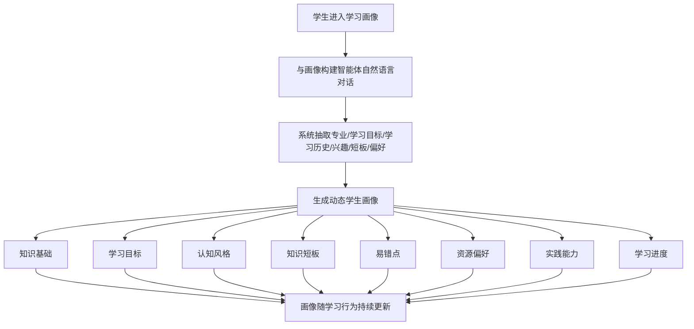

画像维度第一版至少包含：知识基础、学习目标、认知风格、知识短板、易错点、资源偏好、实践能力、学习进度。

### 4.2 多智能体资源生成

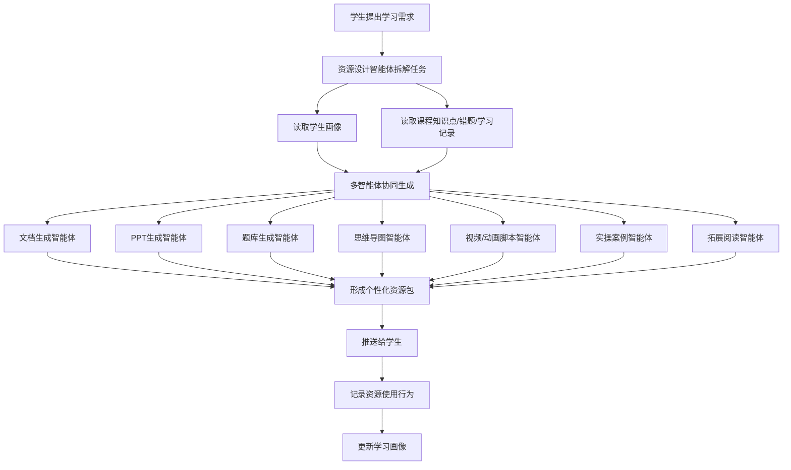

资源生成第一版至少支持：课程讲解文档、PPT、知识点思维导图、练习题 / 题库、拓展阅读材料、视频 / 动画脚本、代码实操案例、实践项目材料。

### 4.3 学习路径规划与资源推送

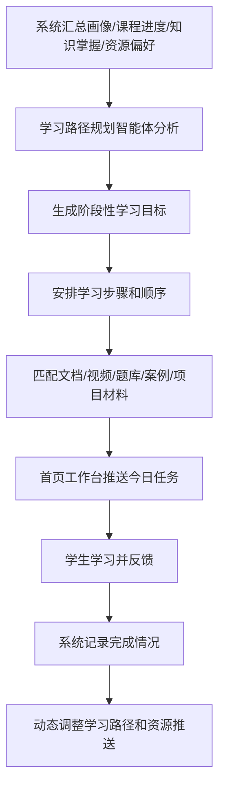

### 4.4 智能辅导

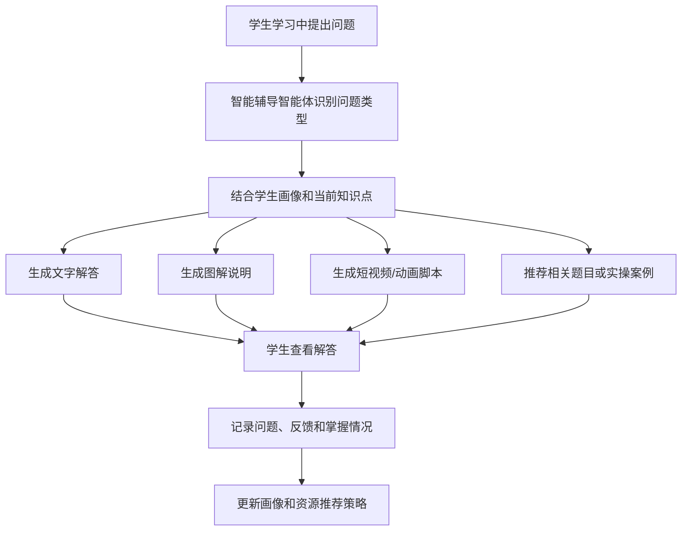

### 4.5 学习效果评估

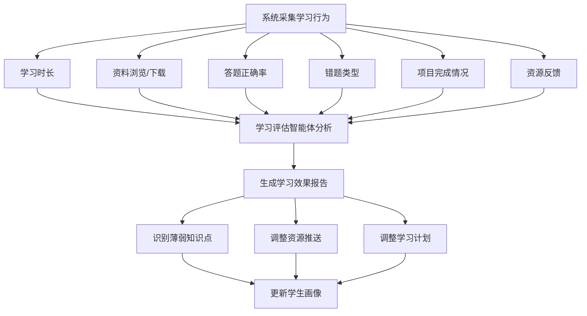

### 4.6 岗位发布与 AI 简历生成

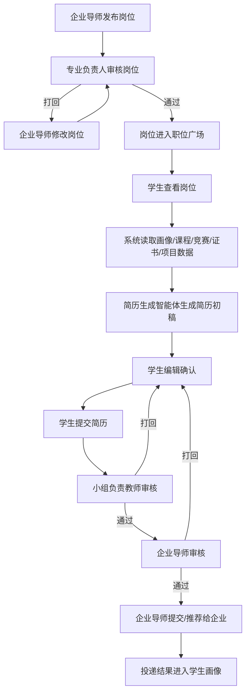

### 4.7 课程学习记录

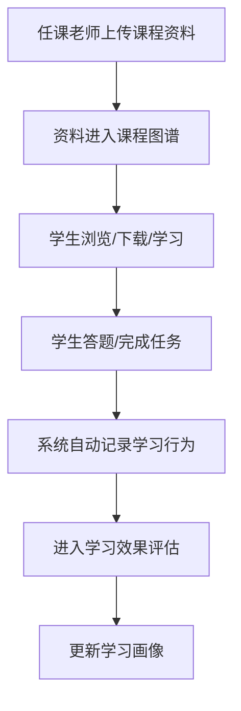

### 4.8 竞赛发布与荣誉审核

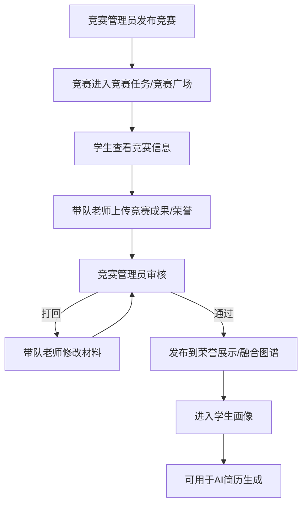

### 4.9 证书标准与证书成果

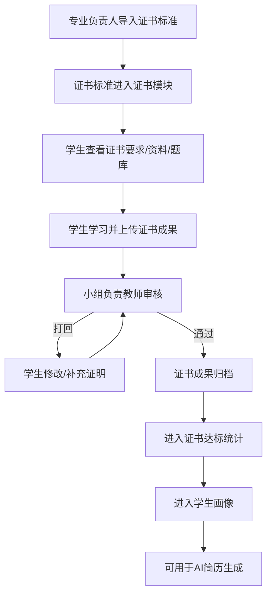

### 4.10 学生画像生成与统计导出

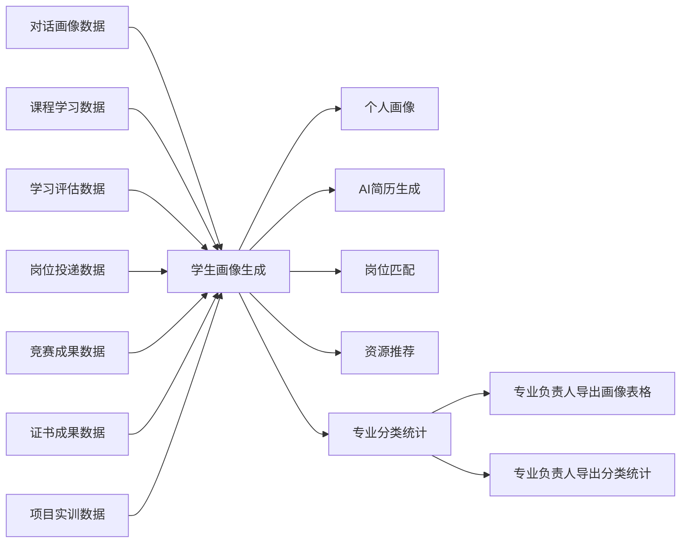

## 5. 权限补充

- 学生可以通过自然语言对话构建学习画像，并在学习过程中动态更新。
- 学生可以调用多智能体生成文档、PPT、题库、思维导图、拓展阅读、视频 / 动画脚本、代码案例、实践项目材料。
- 学生可以查看个性化学习路径和系统推送资源。
- 学生可以使用智能辅导，系统记录问题、反馈和掌握情况。
- 学生可以查看学习效果评估报告。
- 学生可以基于画像和岗课赛证成果生成 AI 简历。
- 小组负责教师审核学生简历，可打回修改。
- 企业导师只审核已通过教师审核并投递到岗位的简历。
- 专业负责人可导出本专业学生画像和分类统计表格。
- 系统管理员配置智能体、模型参数、权限和日志，不直接参与业务审核。

## 6. 导出内容

专业负责人支持导出：

- 学生基础信息表
- 学生画像汇总表
- 学习画像维度统计
- 岗位能力分类统计
- 课程学习进度统计
- 学习效果评估统计
- 竞赛参与与获奖统计
- 证书达标统计
- 项目实训完成统计
- 简历完善度与投递状态统计

## 7. 实现边界

- AI 智能体是系统内部服务，不作为登录用户。
- 多模态视频 / 动画第一版可先生成脚本、分镜、讲解文本和素材方案，后续再接入真实视频生成。
- AI 简历必须由学生确认后才能提交审核，系统不自动代替学生投递。
- 学生画像由对话信息、学习行为、测评结果、资源使用、岗课赛证成果共同生成。
- 专业负责人只能导出自己负责专业范围内的数据。

