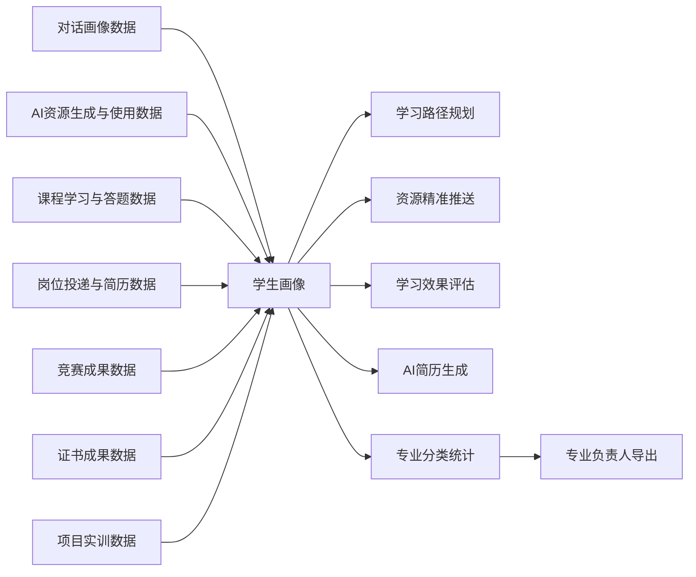

# 数据库 ER 图与核心表清单

## 1. 设计目标

本数据库概念模型基于《AI 岗课赛证学习平台角色需求说明》和《AI 岗课赛证学习平台功能与角色融合方案》设计，围绕 6 条主线建模：

- 用户权限
- 学生画像
- AI 学习中心
- 课程学习
- 岗课赛证成果
- 统计导出

第一版数据库按 MySQL 8 或兼容关系型数据库设计。文件本体不直接存入数据库，只保存文件地址、文件类型、文件大小、上传人和业务关联。

## 2. ER 图

```mermaid
erDiagram
  users ||--o{ user_roles : has
  roles ||--o{ user_roles : binds
  roles ||--o{ role_permissions : has
  permissions ||--o{ role_permissions : grants
  users ||--o| students : maps
  users ||--o| teachers : maps
  users ||--o| enterprise_mentors : maps

  colleges ||--o{ majors : contains
  majors ||--o{ classes : contains
  majors ||--o{ students : owns
  classes ||--o{ students : contains
  teachers ||--o{ teacher_duty_tags : has
  teachers ||--o{ teacher_student_groups : manages
  students ||--o{ teacher_student_groups : assigned

  students ||--o{ profile_conversations : chats
  students ||--o{ student_profiles : owns
  student_profiles ||--o{ profile_dimension_values : contains
  students ||--o{ profile_update_logs : updates

  ai_agents ||--o{ ai_generation_tasks : executes
  students ||--o{ ai_generation_tasks : requests
  ai_generation_tasks ||--o{ ai_generated_resources : outputs
  students ||--o{ learning_paths : owns
  learning_paths ||--o{ learning_path_steps : contains
  students ||--o{ resource_recommendations : receives
  students ||--o{ ai_tutoring_sessions : asks
  students ||--o{ learning_evaluations : evaluated

  courses ||--o{ course_resources : has
  courses ||--o{ course_knowledge_points : has
  teachers ||--o{ course_resources : uploads
  students ||--o{ learning_records : creates
  students ||--o{ quiz_attempts : answers
  quiz_attempts ||--o{ wrong_questions : produces

  enterprises ||--o{ enterprise_mentors : employs
  enterprise_mentors ||--o{ job_posts : publishes
  job_posts ||--o{ job_applications : receives
  students ||--o{ resumes : owns
  resumes ||--o{ job_applications : submitted
  job_applications ||--o{ review_records : reviewed

  competitions ||--o{ competition_results : has
  competition_results ||--o{ review_records : reviewed
  certificates ||--o{ certificate_results : has
  certificate_results ||--o{ review_records : reviewed

  projects ||--o{ project_materials : has
  students ||--o{ project_submissions : submits
  project_submissions ||--o{ learning_evaluations : contributes

  users ||--o{ operation_logs : operates
  users ||--o{ export_records : exports
```

## 3. 核心表清单

| 模块 | 表名 | 用途 |
| --- | --- | --- |
| 用户权限 | `users` | 登录账号，统一承载学生、教师、企业导师等用户 |
| 用户权限 | `roles` | 系统管理员、专业负责人、教师、竞赛管理员、企业导师、学生、数据查看者 |
| 用户权限 | `permissions` | 菜单、按钮、数据、审核、导出等权限点 |
| 用户权限 | `user_roles` | 用户与角色绑定 |
| 用户权限 | `role_permissions` | 角色与权限绑定 |
| 用户权限 | `teacher_duty_tags` | 教师职责标签：任课老师、小组负责教师、带队老师 |
| 基础数据 | `colleges` | 学院基础数据 |
| 基础数据 | `majors` | 专业基础数据 |
| 基础数据 | `classes` | 班级基础数据 |
| 基础数据 | `students` | 学生扩展信息，关联登录账号、专业、班级 |
| 基础数据 | `teachers` | 教师扩展信息，关联登录账号 |
| 基础数据 | `enterprises` | 合作企业信息 |
| 基础数据 | `enterprise_mentors` | 企业导师扩展信息，关联登录账号和企业 |
| 分组管理 | `teacher_student_groups` | 小组负责教师与学生绑定关系 |
| 学习画像 | `profile_conversations` | 对话式画像构建的聊天记录 |
| 学习画像 | `student_profiles` | 学生当前画像主表 |
| 学习画像 | `profile_dimension_values` | 知识基础、学习目标、认知风格、知识短板等维度值 |
| 学习画像 | `profile_update_logs` | 画像随学习行为更新的历史记录 |
| AI 学习中心 | `ai_agents` | AI 智能体配置 |
| AI 学习中心 | `ai_generation_tasks` | 学生发起的资源生成任务 |
| AI 学习中心 | `ai_generated_resources` | 文档、PPT、题库、思维导图、视频脚本、实操案例等生成结果 |
| AI 学习中心 | `learning_paths` | 个性化学习路径主表 |
| AI 学习中心 | `learning_path_steps` | 学习路径步骤 |
| AI 学习中心 | `resource_recommendations` | 资源精准推送记录 |
| AI 学习中心 | `ai_tutoring_sessions` | 智能辅导问答记录 |
| AI 学习中心 | `learning_evaluations` | 学习效果评估报告 |
| 课程学习 | `courses` | 课程基础信息 |
| 课程学习 | `course_knowledge_points` | 课程知识点结构 |
| 课程学习 | `course_resources` | 任课老师上传的 PPT、教案、教学计划等资料 |
| 课程学习 | `learning_records` | 浏览、下载、学习时长、完成任务等行为 |
| 课程学习 | `quiz_attempts` | 答题记录 |
| 课程学习 | `wrong_questions` | 错题记录 |
| 岗位能力 | `job_posts` | 企业导师发布、专业负责人审核的岗位 |
| 岗位能力 | `resumes` | 学生 AI 生成并确认的简历 |
| 岗位能力 | `job_applications` | 岗位投递记录 |
| 竞赛成长 | `competitions` | 竞赛管理员发布的竞赛 |
| 竞赛成长 | `competition_results` | 带队老师上传的竞赛成果和荣誉 |
| 证书达标 | `certificates` | 专业负责人导入的证书标准 |
| 证书达标 | `certificate_results` | 学生上传的证书成果 |
| 项目实训 | `projects` | 实训项目 |
| 项目实训 | `project_materials` | 项目材料、实操案例、项目说明 |
| 项目实训 | `project_submissions` | 学生项目提交与评价依据 |
| 审核流转 | `review_records` | 岗位、简历、竞赛成果、证书成果统一审核记录 |
| 统计导出 | `export_records` | 专业负责人导出画像表和分类统计记录 |
| 日志审计 | `operation_logs` | 登录、导入、生成、审核、导出等操作日志 |

## 4. 核心字段建议

### 4.1 通用字段

业务表统一包含以下字段：

| 字段 | 类型建议 | 说明 |
| --- | --- | --- |
| `id` | bigint | 主键 |
| `status` | varchar(32) | 业务状态 |
| `created_by` | bigint | 创建人用户 ID |
| `created_at` | datetime | 创建时间 |
| `updated_at` | datetime | 更新时间 |
| `deleted_at` | datetime nullable | 软删除时间 |

需要审核的表增加：

| 字段 | 类型建议 | 说明 |
| --- | --- | --- |
| `review_status` | varchar(32) | 审核状态 |
| `submitted_at` | datetime nullable | 提交审核时间 |
| `approved_at` | datetime nullable | 审核通过时间 |

文件类表或包含附件的表增加：

| 字段 | 类型建议 | 说明 |
| --- | --- | --- |
| `file_url` | varchar(512) | 文件访问地址 |
| `file_name` | varchar(255) | 原始文件名 |
| `file_type` | varchar(64) | 文件类型 |
| `file_size` | bigint | 文件大小 |

### 4.2 用户权限与基础数据

| 表名 | 关键字段 |
| --- | --- |
| `users` | `username`、`password_hash`、`real_name`、`phone`、`email`、`account_status`、`must_change_password`、`last_login_at` |
| `roles` | `code`、`name`、`data_scope`、`is_core`、`description` |
| `permissions` | `code`、`name`、`module`、`permission_type` |
| `students` | `user_id`、`student_no`、`college_id`、`major_id`、`class_id`、`grade`、`enrollment_status` |
| `teachers` | `user_id`、`teacher_no`、`college_id`、`title` |
| `teacher_duty_tags` | `teacher_id`、`tag_code`、`tag_name` |
| `teacher_student_groups` | `teacher_id`、`student_id`、`group_name`、`bind_type` |
| `enterprises` | `name`、`industry`、`contact_name`、`contact_phone`、`status` |
| `enterprise_mentors` | `user_id`、`enterprise_id`、`position`、`contact_phone` |

### 4.3 学生画像

| 表名 | 关键字段 |
| --- | --- |
| `profile_conversations` | `student_id`、`message_role`、`message_content`、`extracted_features`、`agent_id` |
| `student_profiles` | `student_id`、`profile_version`、`profile_summary`、`completeness_score`、`last_generated_at` |
| `profile_dimension_values` | `profile_id`、`dimension_code`、`dimension_name`、`dimension_value`、`confidence_score`、`source_type` |
| `profile_update_logs` | `student_id`、`source_type`、`source_id`、`before_snapshot`、`after_snapshot`、`updated_reason` |

画像维度第一版固定为：

- `knowledge_foundation`
- `learning_goal`
- `cognitive_style`
- `knowledge_gap`
- `error_prone_points`
- `resource_preference`
- `practice_ability`
- `learning_progress`

### 4.4 AI 学习中心

| 表名 | 关键字段 |
| --- | --- |
| `ai_agents` | `code`、`name`、`agent_type`、`model_name`、`config_json`、`enabled` |
| `ai_generation_tasks` | `student_id`、`agent_id`、`task_type`、`prompt`、`context_snapshot`、`task_status` |
| `ai_generated_resources` | `task_id`、`resource_type`、`title`、`content_url`、`content_text`、`metadata_json` |
| `learning_paths` | `student_id`、`title`、`goal`、`generated_by_agent_id`、`path_status` |
| `learning_path_steps` | `path_id`、`step_order`、`title`、`resource_id`、`expected_duration`、`completion_status` |
| `resource_recommendations` | `student_id`、`resource_id`、`recommend_reason`、`source_profile_id`、`view_status` |
| `ai_tutoring_sessions` | `student_id`、`question`、`answer_text`、`answer_assets_json`、`knowledge_point_id`、`feedback_score` |
| `learning_evaluations` | `student_id`、`source_type`、`source_id`、`evaluation_summary`、`score_json`、`suggestion_json` |

资源类型统一使用：

- `document`
- `ppt`
- `mind_map`
- `quiz`
- `reading`
- `video_script`
- `practice_case`
- `project_material`

### 4.5 课程学习

| 表名 | 关键字段 |
| --- | --- |
| `courses` | `course_code`、`course_name`、`major_id`、`credit`、`semester` |
| `course_knowledge_points` | `course_id`、`parent_id`、`name`、`description`、`difficulty_level` |
| `course_resources` | `course_id`、`knowledge_point_id`、`uploaded_by_teacher_id`、`resource_type`、`title`、`file_url` |
| `learning_records` | `student_id`、`course_id`、`resource_id`、`action_type`、`duration_seconds`、`completed` |
| `quiz_attempts` | `student_id`、`course_id`、`knowledge_point_id`、`question_snapshot`、`answer`、`is_correct`、`score` |
| `wrong_questions` | `student_id`、`quiz_attempt_id`、`knowledge_point_id`、`wrong_reason`、`review_status` |

### 4.6 岗位、简历与投递

| 表名 | 关键字段 |
| --- | --- |
| `job_posts` | `enterprise_id`、`mentor_id`、`major_id`、`title`、`requirements`、`salary_range`、`location`、`ability_tags`、`review_status` |
| `resumes` | `student_id`、`target_job_id`、`generated_by_task_id`、`resume_content`、`student_confirmed`、`confirmed_at` |
| `job_applications` | `job_id`、`resume_id`、`student_id`、`application_status`、`submitted_at`、`enterprise_feedback` |

岗位与简历流程状态建议：

- 岗位：`draft`、`pending_major_review`、`rejected`、`published`、`archived`
- 简历投递：`draft`、`pending_teacher_review`、`teacher_rejected`、`pending_enterprise_review`、`enterprise_rejected`、`recommended`、`closed`

### 4.7 竞赛、证书与项目实训

| 表名 | 关键字段 |
| --- | --- |
| `competitions` | `title`、`level`、`start_time`、`end_time`、`location`、`requirements`、`official_url`、`published_by` |
| `competition_results` | `competition_id`、`student_id`、`coach_teacher_id`、`award_name`、`proof_file_url`、`review_status` |
| `certificates` | `major_id`、`certificate_name`、`requirement_level`、`graduation_required`、`resource_url`、`imported_by` |
| `certificate_results` | `certificate_id`、`student_id`、`certificate_no`、`issued_at`、`proof_file_url`、`review_status` |
| `projects` | `course_id`、`title`、`description`、`difficulty_level`、`ability_tags` |
| `project_materials` | `project_id`、`material_type`、`title`、`file_url`、`content_text` |
| `project_submissions` | `project_id`、`student_id`、`submission_url`、`score`、`teacher_comment` |

### 4.8 审核、日志与导出

| 表名 | 关键字段 |
| --- | --- |
| `review_records` | `target_type`、`target_id`、`review_node`、`reviewer_user_id`、`review_result`、`review_comment`、`reviewed_at` |
| `export_records` | `export_type`、`export_scope`、`major_id`、`exported_by`、`file_url`、`export_status` |
| `operation_logs` | `operator_id`、`operator_role`、`module`、`action`、`target_type`、`target_id`、`result`、`ip_address`、`remark` |

`review_records.target_type` 第一版支持：

- `job_post`
- `resume`
- `job_application`
- `competition_result`
- `certificate_result`

## 5. 关键状态与枚举

### 5.1 通用业务状态

- `draft`
- `pending`
- `approved`
- `rejected`
- `published`
- `archived`

### 5.2 学习行为类型

- `view`
- `download`
- `study`
- `quiz`
- `complete_task`
- `feedback`

### 5.3 AI 任务状态

- `queued`
- `running`
- `succeeded`
- `failed`
- `cancelled`

### 5.4 导出类型

- `student_basic_info`
- `student_profile_summary`
- `profile_dimension_statistics`
- `job_ability_statistics`
- `course_learning_progress`
- `learning_effect_statistics`
- `competition_award_statistics`
- `certificate_completion_statistics`
- `project_training_statistics`
- `resume_application_statistics`

## 6. 数据流闭环

## 7. 校验要点

- 每个登录角色都有对应用户扩展表或权限绑定方式。
- 10 条核心流程都能在表关系中闭环：画像、资源生成、路径推送、辅导、评估、岗位简历、课程、竞赛、证书、统计导出。
- 所有可打回流程都有 `review_records` 可记录审核人、审核节点、审核意见和结果。
- 专业负责人只能按专业范围导出学生画像和分类统计。
- 学生画像、AI 简历、资源推荐都能追溯到原始数据来源。

## 8. 第一版边界

- 统计报表第一版可由业务表实时查询生成，后续数据量变大再增加汇总表。
- AI 生成的视频 / 动画第一版先存脚本、分镜和素材方案，不强制存真实视频文件。
- AI 简历只从已确认画像、学习记录、项目、竞赛、证书等数据生成，学生确认后才进入投递流程。
- 审核流程第一版用固定节点实现，后续再扩展为可配置工作流。

