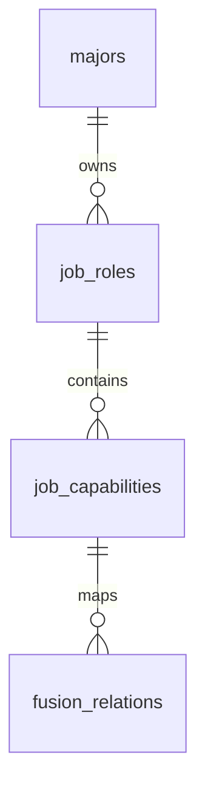
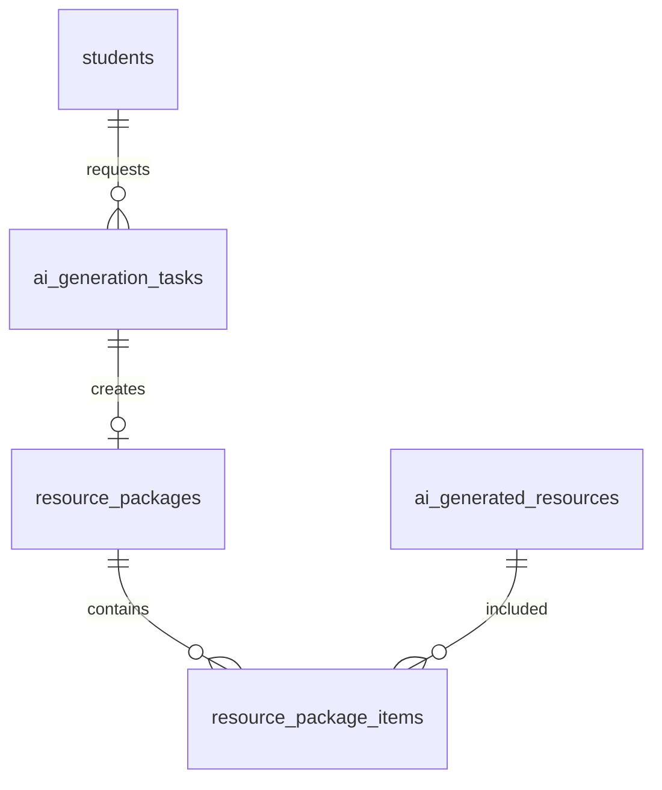
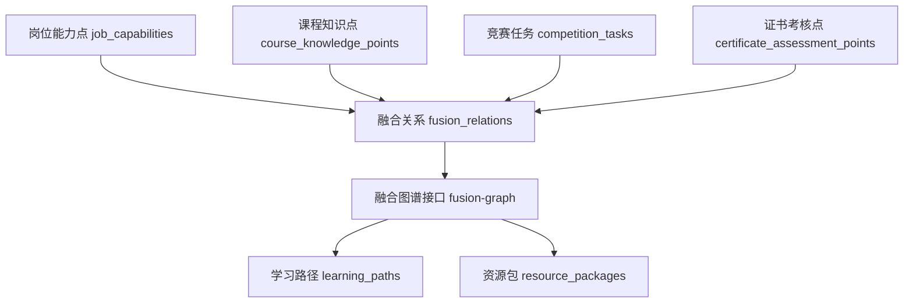
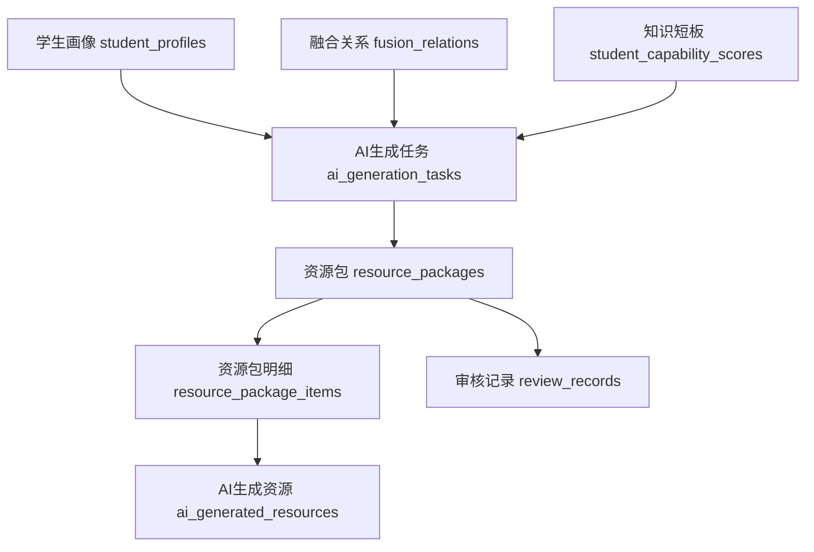
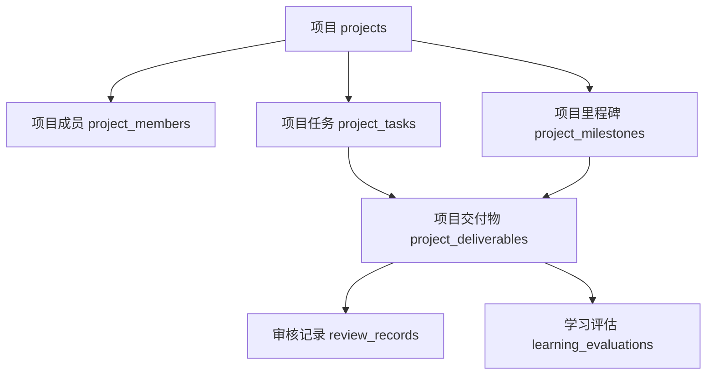

# 数据库表结构升级设计

## 1. 升级目标

后端接口已经从基础 CRUD 扩展为“岗课赛证融合 + 个性化学习资源生成 + 多智能体协同”的业务闭环，因此数据库需要补充第一版缺失的融合能力层和过程管理层表结构。

本次升级不推翻现有 `database/schema.sql`，而是在现有 45 张核心表基础上增量补表，重点支撑：

- 岗位能力模型和岗位能力点。
- 课程知识点之间的前置、支撑、推荐关系。
- 竞赛任务点、证书能力单元、证书考核点。
- 岗课赛证融合映射关系和融合图谱。
- 对话式画像会话。
- 多智能体资源包和资源包审核发布。
- 教师任务、竞赛过程、项目过程管理。
- 学生能力得分和知识短板分析。

对应增量 SQL 文件：

`database/migrations/001_fusion_api_upgrade.sql`

## 2. 升级原则

- **增量优先**：保留现有表，不重建已有数据表。
- **复用优先**：已有 `courses`、`course_knowledge_points`、`ai_generation_tasks`、`ai_generated_resources`、`learning_paths`、`review_records` 继续使用。
- **多态关系统一**：岗课赛证融合关系使用 `source_type + source_id + target_type + target_id`，避免为每种关系单独建表。
- **过程数据可追溯**：资源包生成、教师任务、竞赛里程碑、项目交付物都保留状态、创建人和时间。
- **审核不分散**：所有审核动作仍统一写入 `review_records`，业务表只保存当前审核状态。
- **敏感信息不扩散**：新增表不保存明文手机号、邮箱、身份证号、密码等认证或隐私数据。

## 3. 新增表总览

| 模块 | 新增表 | 作用 |
| --- | --- | --- |
| 岗位能力 | `job_roles` | 岗位能力模型，例如 AI 应用开发助理、人工智能训练师 |
| 岗位能力 | `job_capabilities` | 岗位能力点，例如 API 调用、数据处理、模型评估 |
| 课程图谱 | `knowledge_point_relations` | 知识点前置、支撑、推荐关系 |
| 融合关系 | `fusion_relations` | 岗课赛证能力映射关系 |
| 学生能力 | `student_capability_scores` | 学生在某能力点、知识点、证书考核点上的掌握度 |
| 画像会话 | `profile_sessions` | 对话式画像构建会话 |
| 画像会话 | `profile_session_messages` | 画像会话消息，内容加密存储 |
| 资源包 | `resource_packages` | 一次多智能体生成形成的资源包 |
| 资源包 | `resource_package_items` | 资源包与 AI 生成资源的关联 |
| 资源包 | `ai_generation_task_logs` | 生成任务执行日志 |
| 竞赛任务 | `competition_tasks` | 竞赛拆解任务点 |
| 竞赛过程 | `competition_teams` | 竞赛团队 |
| 竞赛过程 | `competition_team_members` | 竞赛团队成员 |
| 竞赛过程 | `competition_milestones` | 竞赛备赛里程碑 |
| 竞赛过程 | `competition_deliverables` | 竞赛交付物 |
| 证书能力 | `certificate_units` | 证书能力单元 |
| 证书能力 | `certificate_assessment_points` | 证书考核点 |
| 证书练习 | `certificate_practice_attempts` | 证书专项练习记录 |
| 教师工作台 | `teacher_tasks` | 教师发布的学习、竞赛、证书、项目任务 |
| 教师工作台 | `teacher_task_targets` | 教师任务下发对象 |
| 项目过程 | `project_members` | 项目成员 |
| 项目过程 | `project_tasks` | 项目任务 |
| 项目过程 | `project_milestones` | 项目里程碑 |
| 项目过程 | `project_deliverables` | 项目交付物 |

## 4. 关键表说明

### 4.1 岗位能力模型

`job_roles` 解决“岗位能力”与“真实招聘岗位”混在一起的问题。第一版软件杯主线使用 `job_roles` 和 `job_capabilities`，二期就业模块再使用现有 `job_posts`。

核心关系：



典型数据：

- 岗位模型：AI 应用开发助理
- 岗位能力点：Python 编程基础、API 调用、RAG 知识库搭建、模型评估

### 4.2 融合关系

`fusion_relations` 是岗课赛证融合图谱的核心表。

统一关系格式：

```json
{
  "sourceType": "job_capability",
  "sourceId": 1,
  "targetType": "course_knowledge_point",
  "targetId": 12,
  "relationType": "supports",
  "weight": 0.85,
  "description": "Python基础支撑AI应用开发助理岗位能力"
}
```

推荐类型约定：

| 类型 | 含义 |
| --- | --- |
| `supports` | 支撑关系 |
| `requires` | 前置要求 |
| `improves` | 提升关系 |
| `assesses` | 考核关系 |
| `recommends` | 推荐关系 |

### 4.3 多智能体资源包

现有 `ai_generation_tasks` 和 `ai_generated_resources` 只表达“任务”和“单个资源”。新增 `resource_packages` 后，一次生成可以形成资源包：

- 讲解文档
- PPT
- 题库
- 思维导图
- 视频 / 动画脚本
- 实操案例
- 项目材料



资源包读取学生画像、目标岗位、课程知识点、竞赛任务、证书考核点和知识短板，生成后可提交教师审核，审核记录仍写入 `review_records`。

### 4.4 画像会话

现有 `profile_conversations` 能保存单条对话记录，但接口设计需要明确的会话生命周期。因此新增：

- `profile_sessions`：会话主表，记录会话状态、画像草稿、确认状态。
- `profile_session_messages`：消息表，内容加密存储。

画像确认后继续写入现有：

- `student_profiles`
- `profile_dimension_values`
- `profile_update_logs`

### 4.5 竞赛与项目过程

竞赛不只记录最终获奖，还要记录备赛任务、团队、里程碑、交付物，体现“以赛促学”。

项目不只记录项目资料和最终提交，还要记录成员、任务、里程碑、交付物，体现“项目实训过程”。

这些过程数据会进入：

- `learning_records`
- `learning_evaluations`
- `student_capability_scores`
- `student_profiles`

## 5. 与现有表的关系

| 现有表 | 继续作用 | 新增关系 |
| --- | --- | --- |
| `courses` | 课程主表 | 被 `job_roles`、`resource_packages`、`fusion_relations` 间接引用 |
| `course_knowledge_points` | 课程知识点 | 被 `knowledge_point_relations`、`fusion_relations`、`student_capability_scores` 引用 |
| `ai_generation_tasks` | AI 生成任务 | 与 `resource_packages` 一对一或一对多关联 |
| `ai_generated_resources` | AI 生成资源 | 通过 `resource_package_items` 归入资源包 |
| `learning_paths` | 学习路径 | 继续作为路径主表，可通过上下文 JSON 记录目标岗位与融合依据 |
| `competitions` | 竞赛主表 | 新增竞赛任务、团队、里程碑、交付物 |
| `certificates` | 证书标准 | 新增能力单元、考核点、专项练习 |
| `projects` | 项目主表 | 新增成员、任务、里程碑、交付物 |
| `review_records` | 统一审核记录 | 资源包、竞赛交付物、项目交付物等审核继续写入 |

## 6. 核心流程落表

### 6.1 融合图谱生成



### 6.2 资源包生成



### 6.3 项目过程管理



## 7. 状态枚举建议

### 7.1 资源包状态

| 状态 | 含义 |
| --- | --- |
| `generating` | 生成中 |
| `generated` | 已生成 |
| `pending_review` | 待审核 |
| `rejected` | 已打回 |
| `published` | 已发布 |
| `archived` | 已归档 |

### 7.2 任务状态

| 状态 | 含义 |
| --- | --- |
| `draft` | 草稿 |
| `published` | 已发布 |
| `in_progress` | 进行中 |
| `submitted` | 已提交 |
| `reviewing` | 审核中 |
| `completed` | 已完成 |
| `rejected` | 已打回 |
| `archived` | 已归档 |

### 7.3 能力掌握状态

| 状态 | 含义 |
| --- | --- |
| `unknown` | 未评估 |
| `weak` | 薄弱 |
| `developing` | 提升中 |
| `qualified` | 达标 |
| `excellent` | 优秀 |

## 8. 索引设计

重点查询索引：

- `job_roles.major_id`
- `job_capabilities.job_role_id`
- `fusion_relations.source_type, source_id`
- `fusion_relations.target_type, target_id`
- `student_capability_scores.student_id, target_type, target_id`
- `resource_packages.student_id`
- `resource_packages.target_job_role_id`
- `resource_packages.review_status`
- `competition_tasks.competition_id`
- `certificate_units.certificate_id`
- `certificate_assessment_points.unit_id`
- `teacher_tasks.teacher_id`
- `teacher_task_targets.target_type, target_id`
- `project_tasks.project_id`
- `project_deliverables.project_id, review_status`

## 9. 迁移执行顺序

1. 备份当前数据库。
2. 执行 `database/schema.sql` 和 `database/seed.sql` 的环境无需重复执行。
3. 执行 `database/migrations/001_fusion_api_upgrade.sql`。
4. 检查新增表是否创建成功。
5. 后续再补充对应测试数据和权限种子升级。

## 10. 验收标准

- 岗位能力模型可以维护岗位和能力点。
- 课程知识点、岗位能力点、竞赛任务、证书考核点之间可以建立融合关系。
- 画像会话可以支持创建、对话、抽取、确认流程。
- AI 资源生成可以形成资源包，并关联多个资源文件。
- 教师任务可以下发到学生、班级、专业或项目。
- 竞赛和项目可以记录团队、任务、里程碑、交付物和审核结果。
- 证书标准可以拆分为能力单元和考核点。
- 学生能力得分可以支撑知识短板、推荐资源和学习效果评估。

## 11. 后续建议

本次升级完成后，下一步应做：

1. 更新初始化种子，补充岗位能力模型、融合关系样例、证书能力单元、竞赛任务样例。
2. 更新接口文档中的表依赖说明。
3. 再绘制核心业务时序图，明确接口、服务、数据库和 AI 智能体的调用顺序。
