# 核心业务时序图设计

## 1. 设计说明

本文档只绘制第一版系统演示和业务闭环中最关键的时序图，不覆盖普通 CRUD。

时序图重点说明：

- 用户、前端、后端服务、数据库、AI 智能体、审核人之间的调用关系。
- 哪些步骤需要写入操作日志、审核记录、导出记录。
- 哪些节点需要加密、脱敏、权限校验。
- 哪些流程支持打回重做。

系统统一约定：

- 所有接口统一前缀为 `/api/v1`。
- 写操作统一记录 `operation_logs`。
- 审核操作统一记录 `review_records`。
- 导出操作统一记录 `export_records`。
- 敏感字段默认加密存储、脱敏返回。

## 2. 学生登录与首次改密

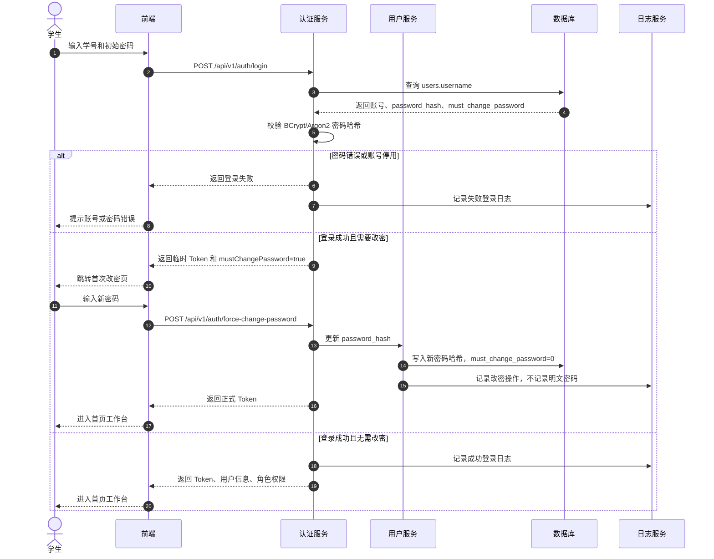

## 3. 专业负责人导入学生账号

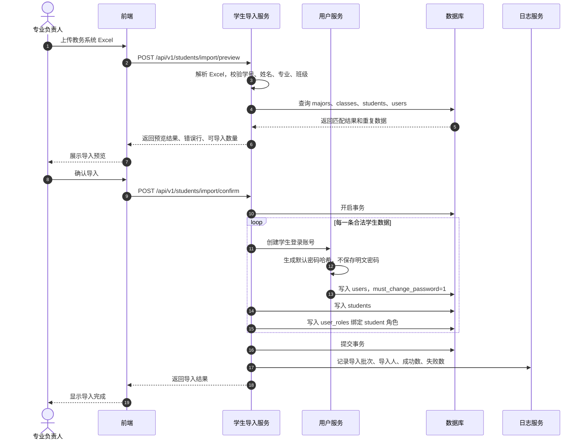

## 4. 对话式学习画像构建

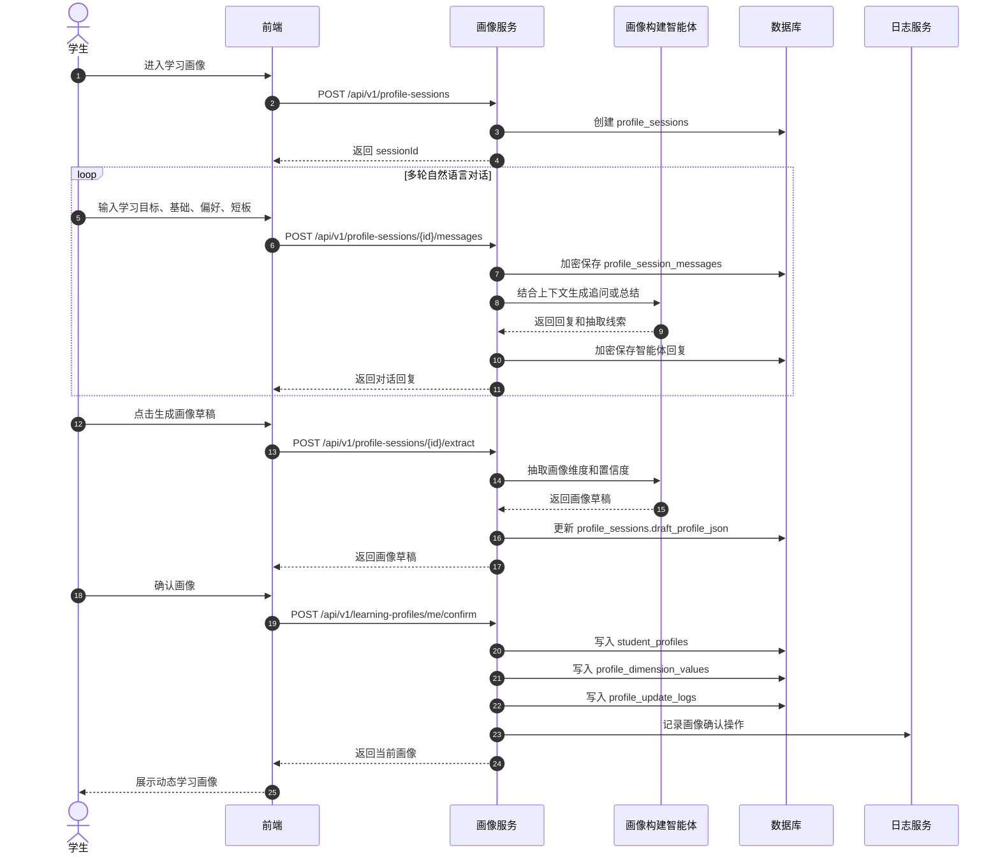

## 5. 多智能体资源包生成

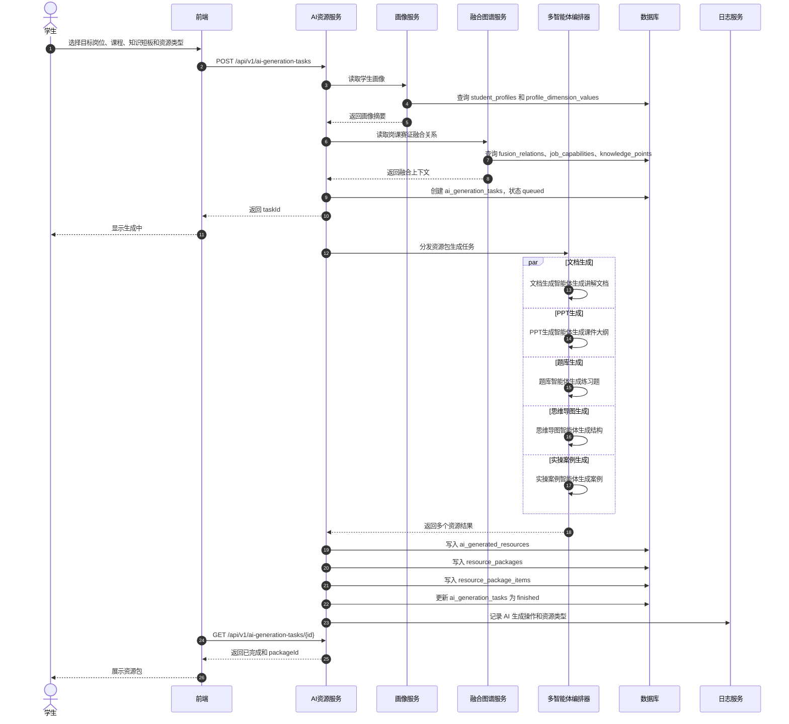

## 6. 学习路径生成与资源推送

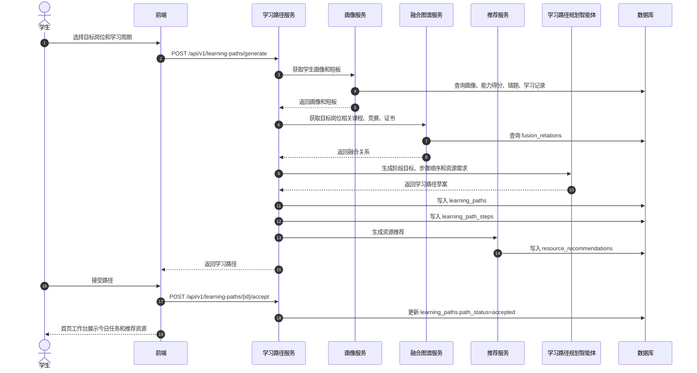

## 7. 学习记录与学习效果评估

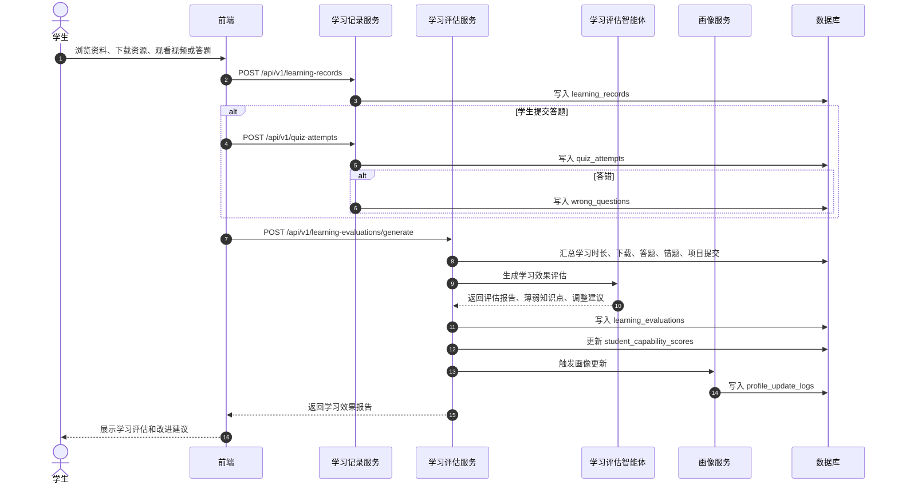

## 8. 岗课赛证融合图谱生成

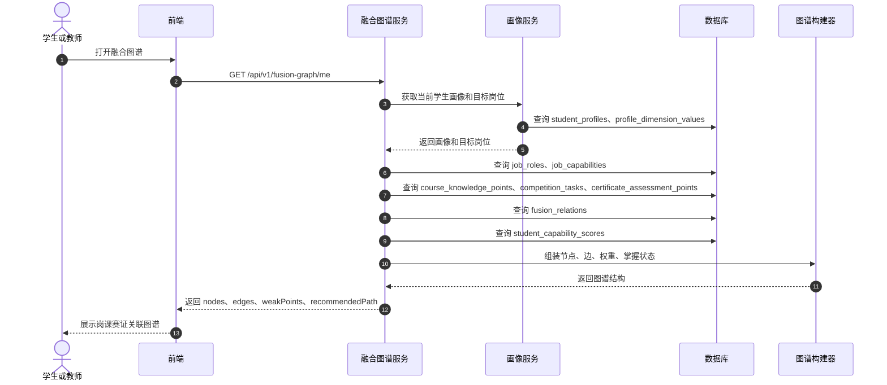

## 9. 竞赛成果上传与审核

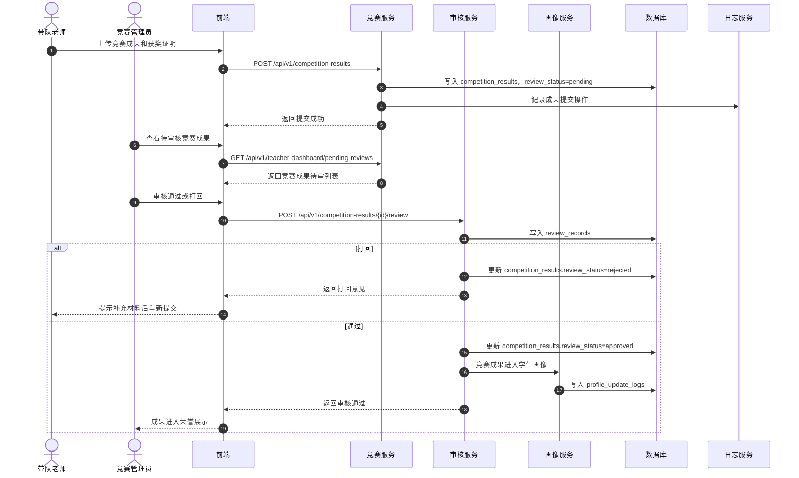

## 10. 证书成果上传与审核

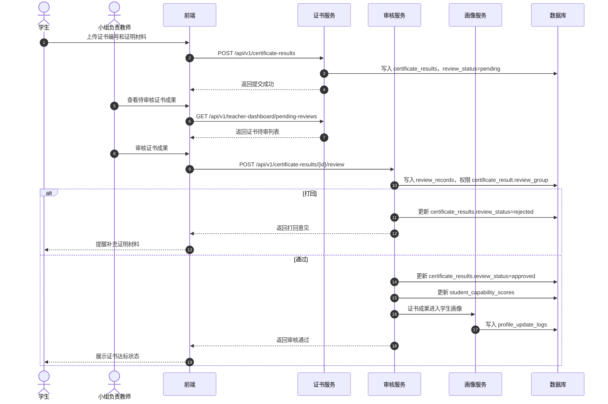

## 11. 教师审核资源包

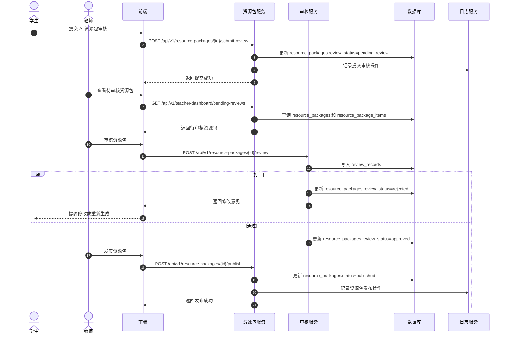

## 12. 统计导出与脱敏记录

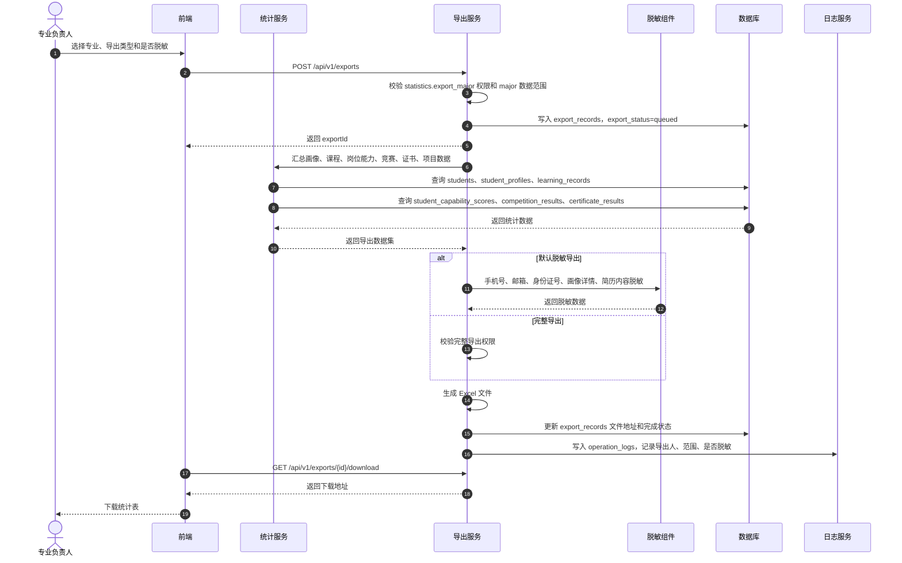

## 13. 二期扩展：AI 简历生成与岗位投递

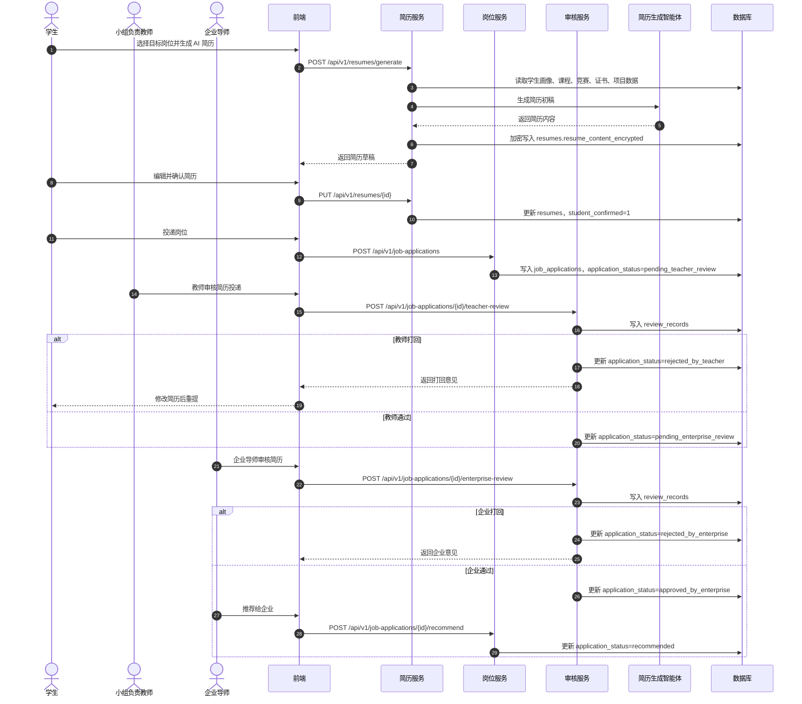

## 14. 时序图覆盖关系

| 序号 | 时序图 | 覆盖模块 |
| --- | --- | --- |
| 1 | 学生登录与首次改密 | 认证、用户、密码哈希、登录日志 |
| 2 | 专业负责人导入学生账号 | 学生导入、账号生成、角色绑定 |
| 3 | 对话式学习画像构建 | 画像会话、智能体、画像确认 |
| 4 | 多智能体资源包生成 | AI 任务、资源包、融合上下文 |
| 5 | 学习路径生成与资源推送 | 学习路径、资源推荐、画像短板 |
| 6 | 学习记录与学习效果评估 | 学习记录、答题、错题、评估 |
| 7 | 岗课赛证融合图谱生成 | 岗位能力、课程、竞赛、证书、融合关系 |
| 8 | 竞赛成果上传与审核 | 竞赛成果、审核、荣誉展示 |
| 9 | 证书成果上传与审核 | 证书成果、审核、达标统计 |
| 10 | 教师审核资源包 | 资源包审核、发布 |
| 11 | 统计导出与脱敏记录 | 统计、导出、脱敏、日志 |
| 12 | AI 简历生成与岗位投递 | 二期就业扩展 |
