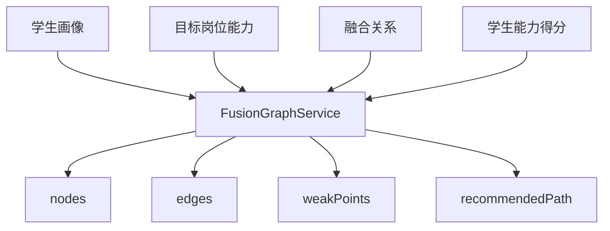

# Spring Boot 后端详细设计

## 1. 技术路线

后端采用 Spring Boot 构建，服务第一版聚焦“岗课赛证融合 + 个性化学习资源生成 + 多智能体协同学习”的核心闭环。

推荐技术栈：

| 类型 | 选型 | 说明 |
| --- | --- | --- |
| JDK | Java 17 | Spring Boot 3 稳定推荐版本 |
| 框架 | Spring Boot 3.x | REST API、配置管理、依赖注入 |
| 安全 | Spring Security + JWT | 登录鉴权、接口权限校验 |
| ORM | MyBatis-Plus | 适合 MySQL、CRUD、分页、软删除 |
| 数据库 | MySQL 8 | 已完成表结构和迁移脚本 |
| 数据库迁移 | Flyway，可选 | 第一版可先手动执行 SQL，后续纳入 Flyway |
| 参数校验 | Jakarta Validation | DTO 入参校验 |
| 文档 | springdoc-openapi | 自动生成 Swagger / OpenAPI |
| Excel | EasyExcel | 学生导入、统计导出 |
| JSON | Jackson | JSON 字段、统一响应 |
| 密码 | BCrypt / Argon2 | 只保存密码哈希 |
| 加密 | AES-256-GCM | 手机号、邮箱、画像、简历等敏感字段加密 |
| 日志 | Logback + MDC | traceId、操作日志 |
| AI 调用 | 独立 AiClient 接口 | 第一版可 mock，后续接真实大模型 |

第一版建议使用单体应用，模块内分包。等功能稳定后再考虑拆微服务。

## 2. 工程结构

建议工程名：

`ai-learning-platform-backend`

包名：

`com.example.ailearning`

推荐目录：

```text
ai-learning-platform-backend
├── pom.xml
├── src/main/java/com/example/ailearning
│   ├── AiLearningApplication.java
│   ├── common
│   │   ├── api
│   │   ├── config
│   │   ├── constant
│   │   ├── crypto
│   │   ├── exception
│   │   ├── log
│   │   ├── pagination
│   │   ├── security
│   │   └── validation
│   ├── module
│   │   ├── auth
│   │   ├── user
│   │   ├── base
│   │   ├── student
│   │   ├── teacher
│   │   ├── profile
│   │   ├── fusion
│   │   ├── ai
│   │   ├── course
│   │   ├── competition
│   │   ├── certificate
│   │   ├── project
│   │   ├── review
│   │   ├── statistics
│   │   └── audit
│   └── integration
│       ├── ai
│       ├── file
│       └── excel
├── src/main/resources
│   ├── application.yml
│   ├── application-dev.yml
│   ├── mapper
│   └── db/migration
└── src/test/java/com/example/ailearning
```

## 3. 分层规范

每个业务模块建议按以下结构组织：

```text
module/fusion
├── controller
├── service
├── service/impl
├── mapper
├── entity
├── dto
├── vo
├── converter
└── constant
```

| 层 | 职责 |
| --- | --- |
| Controller | 接收请求、参数校验、返回统一响应 |
| Service | 编排业务流程、事务、权限范围校验 |
| Mapper | 数据库访问，复杂查询写 XML |
| Entity | 与数据库表字段对应 |
| DTO | 请求入参 |
| VO | 响应出参，敏感字段默认脱敏 |
| Converter | Entity、DTO、VO 转换 |
| Integration | AI、文件、Excel 等外部能力适配 |

约束：

- Controller 不直接调用 Mapper。
- Controller 不写业务判断。
- Service 负责事务边界。
- Mapper 不做权限判断。
- VO 不返回密文字段、IV、password_hash。

## 4. 通用组件设计

### 4.1 统一响应

```java
public class ApiResponse<T> {
    private int code;
    private String message;
    private T data;
    private String traceId;
}
```

成功：

```json
{
  "code": 0,
  "message": "success",
  "data": {},
  "traceId": "..."
}
```

### 4.2 分页响应

```java
public class PageResult<T> {
    private List<T> items;
    private long page;
    private long pageSize;
    private long total;
}
```

### 4.3 异常码

| code | 含义 |
| --- | --- |
| 0 | 成功 |
| 40000 | 请求参数错误 |
| 40100 | 未登录或 Token 无效 |
| 40300 | 无权限 |
| 40310 | 无数据范围权限 |
| 40400 | 数据不存在 |
| 40900 | 数据冲突 |
| 50000 | 系统异常 |
| 50200 | AI 服务调用失败 |

### 4.4 软删除

所有业务查询默认追加：

```sql
deleted_at IS NULL
```

删除接口只更新 `deleted_at` 和 `status`，不物理删除。

### 4.5 traceId

使用 Filter 在每个请求入口生成或读取 `X-Trace-Id`，写入 MDC：

- 响应体返回 `traceId`
- 日志自动打印 `traceId`
- `operation_logs` 写入关键操作时带上 traceId

## 5. 认证与权限

### 5.1 登录流程

模块：

- `AuthController`
- `AuthService`
- `JwtTokenService`
- `PasswordService`

核心步骤：

1. 根据用户名查询 `users`。
2. 校验账号状态。
3. 使用 BCrypt / Argon2 校验密码。
4. 查询角色和权限。
5. 生成 JWT。
6. 如果 `must_change_password = 1`，返回强制改密标记。
7. 写入登录日志。

### 5.2 权限注解

建议自定义注解：

```java
@RequirePermission("fusion.relation.manage")
```

也可以使用 Spring Security：

```java
@PreAuthorize("hasAuthority('fusion.relation.manage')")
```

第一版建议封装自定义注解，便于后续加入数据范围校验。

### 5.3 数据范围

数据范围由角色和业务绑定共同决定：

| 角色 | 数据范围 |
| --- | --- |
| admin | 全平台 |
| major_leader | 绑定专业 |
| teacher | 负责学生、课程、项目、竞赛团队 |
| student | 本人 |
| enterprise_mentor | 本企业、本导师发布岗位 |
| data_viewer | 只读范围 |

建议实现：

- `CurrentUserContext`
- `PermissionService`
- `DataScopeService`

典型方法：

```java
boolean canViewStudent(Long currentUserId, Long studentId);
boolean canManageMajor(Long currentUserId, Long majorId);
List<Long> getAssignedStudentIds(Long teacherUserId);
```

## 6. 敏感信息加密与脱敏

### 6.1 密码

只保存：

`users.password_hash`

不得保存：

- 明文密码
- 可逆加密密码
- 默认密码明文

### 6.2 隐私字段加密

应用层使用 AES-256-GCM：

| 字段类型 | 存储方式 |
| --- | --- |
| 手机号 | `phone_encrypted` + `phone_iv` + `phone_hash` |
| 邮箱 | `email_encrypted` + `email_iv` + `email_hash` |
| 画像内容 | `xxx_encrypted` + `xxx_iv` |
| 简历内容 | `resume_content_encrypted` + `resume_content_iv` |
| 智能辅导问答 | `question_encrypted`、`answer_text_encrypted` |

`hash` 字段用于精确查询，不做模糊搜索。

### 6.3 VO 脱敏

脱敏工具：

`DesensitizeUtil`

规则：

- 手机号：`138****5678`
- 邮箱：`ab***@example.com`
- 身份证号：只显示前 3 位和后 4 位
- 画像详情：默认返回摘要
- 简历内容：默认返回摘要

## 7. 操作日志与审核记录

### 7.1 操作日志

写操作统一记录 `operation_logs`。

建议使用注解：

```java
@OperationLog(module = "fusion", action = "create_relation")
```

记录内容：

- 操作人
- 操作角色
- 模块
- 动作
- 目标类型
- 目标 ID
- 结果
- IP
- 备注

不得记录明文密码、完整手机号、完整邮箱、完整身份证号。

### 7.2 审核记录

所有审核统一写入 `review_records`：

- 资源包审核
- 证书成果审核
- 竞赛成果审核
- 项目交付物审核
- 二期岗位简历审核

业务表只保存当前状态，历史流程看 `review_records`。

## 8. 核心模块详细设计

### 8.1 Auth 模块

主要接口：

- `POST /api/v1/auth/login`
- `POST /api/v1/auth/force-change-password`
- `GET /api/v1/auth/me`
- `GET /api/v1/auth/me/menus`
- `GET /api/v1/auth/me/permissions`

核心 Service：

| Service | 职责 |
| --- | --- |
| `AuthService` | 登录、退出、当前用户 |
| `PasswordService` | 密码校验、密码哈希、强制改密 |
| `JwtTokenService` | Token 生成和解析 |

### 8.2 Student 模块

主要接口：

- `GET /api/v1/students`
- `POST /api/v1/students/import/preview`
- `POST /api/v1/students/import/confirm`

核心 Service：

| Service | 职责 |
| --- | --- |
| `StudentService` | 学生查询、修改、停用 |
| `StudentImportService` | Excel 解析、预校验、账号生成 |
| `StudentAccountService` | 学号账号、默认密码哈希、角色绑定 |

导入事务：

1. 创建 `users`
2. 创建 `students`
3. 绑定 `user_roles`
4. 写入操作日志

### 8.3 Profile 模块

主要接口：

- `POST /api/v1/profile-sessions`
- `POST /api/v1/profile-sessions/{id}/messages`
- `POST /api/v1/profile-sessions/{id}/extract`
- `POST /api/v1/learning-profiles/me/confirm`

核心 Service：

| Service | 职责 |
| --- | --- |
| `ProfileSessionService` | 画像会话生命周期 |
| `ProfileMessageService` | 加密保存对话消息 |
| `ProfileExtractionService` | 调用画像构建智能体抽取维度 |
| `StudentProfileService` | 正式画像、维度值、版本记录 |

画像维度：

- 知识基础
- 学习目标
- 认知风格
- 知识短板
- 易错点
- 资源偏好
- 实践能力
- 学习进度

### 8.4 Fusion 模块

主要接口：

- `GET /api/v1/job-roles`
- `POST /api/v1/job-roles`
- `POST /api/v1/job-roles/{id}/capabilities`
- `POST /api/v1/fusion-relations`
- `GET /api/v1/fusion-graph/me`
- `GET /api/v1/fusion-graph/students/{studentId}`

核心 Service：

| Service | 职责 |
| --- | --- |
| `JobRoleService` | 岗位能力模型 |
| `JobCapabilityService` | 岗位能力点 |
| `FusionRelationService` | 融合关系维护 |
| `FusionGraphService` | 图谱节点、边、权重、短板组装 |
| `CapabilityScoreService` | 学生能力得分 |

图谱生成逻辑：



### 8.5 AI Resource 模块

主要接口：

- `POST /api/v1/ai-generation-tasks`
- `GET /api/v1/ai-generation-tasks/{id}`
- `GET /api/v1/resource-packages/{id}`
- `POST /api/v1/resource-packages/{id}/submit-review`
- `POST /api/v1/resource-packages/{id}/review`
- `POST /api/v1/resource-packages/{id}/publish`

核心 Service：

| Service | 职责 |
| --- | --- |
| `AiGenerationTaskService` | AI 任务创建、取消、重试、状态 |
| `ResourcePackageService` | 资源包创建、审核状态、发布 |
| `ResourcePackageReviewService` | 资源包审核，写入 `review_records` |
| `AiOrchestratorService` | 多智能体编排 |
| `AiGeneratedResourceService` | 单个资源保存、预览、下载 |

第一版 AI 调用策略：

- 开发阶段可用 Mock 智能体返回固定资源。
- 演示阶段可接入真实大模型。
- AI 调用失败时任务状态变为 `failed`，记录 `ai_generation_task_logs`。

### 8.6 Learning Path 模块

主要接口：

- `POST /api/v1/learning-paths/generate`
- `GET /api/v1/learning-paths/me`
- `POST /api/v1/learning-paths/{id}/accept`
- `POST /api/v1/learning-paths/{id}/adjust`
- `POST /api/v1/learning-path-steps/{id}/complete`

核心 Service：

| Service | 职责 |
| --- | --- |
| `LearningPathService` | 路径生成、接受、调整 |
| `LearningPathStepService` | 步骤状态 |
| `ResourceRecommendationService` | 资源推送 |

路径生成输入：

- 学生画像
- 目标岗位
- 竞赛任务
- 证书要求
- 知识短板
- 资源偏好

### 8.7 Course 模块

主要接口：

- `GET /api/v1/courses`
- `GET /api/v1/courses/{id}/knowledge-points`
- `POST /api/v1/knowledge-point-relations`
- `GET /api/v1/courses/{id}/graph`
- `POST /api/v1/learning-records`
- `POST /api/v1/quiz-attempts`

核心 Service：

| Service | 职责 |
| --- | --- |
| `CourseService` | 课程基础信息 |
| `CourseResourceService` | 课程资料 |
| `KnowledgePointService` | 知识点 |
| `KnowledgePointRelationService` | 知识点前置、支撑、推荐关系 |
| `LearningRecordService` | 学习行为记录 |
| `QuizAttemptService` | 答题和错题 |

### 8.8 Competition 模块

主要接口：

- `GET /api/v1/competitions`
- `GET /api/v1/competition-tasks`
- `POST /api/v1/competition-results`
- `POST /api/v1/competition-results/{id}/review`
- `POST /api/v1/competition-teams`
- `POST /api/v1/competition-deliverables`

核心 Service：

| Service | 职责 |
| --- | --- |
| `CompetitionService` | 竞赛基础信息 |
| `CompetitionTaskService` | 竞赛任务点 |
| `CompetitionResultService` | 竞赛成果 |
| `CompetitionTeamService` | 团队和成员 |
| `CompetitionMilestoneService` | 备赛里程碑 |
| `CompetitionDeliverableService` | 竞赛交付物 |

### 8.9 Certificate 模块

主要接口：

- `GET /api/v1/certificates`
- `POST /api/v1/certificates/{id}/units`
- `POST /api/v1/certificate-units/{id}/assessment-points`
- `POST /api/v1/certificate-results`
- `POST /api/v1/certificate-results/{id}/review`

核心 Service：

| Service | 职责 |
| --- | --- |
| `CertificateService` | 证书标准 |
| `CertificateUnitService` | 证书能力单元 |
| `CertificateAssessmentPointService` | 证书考核点 |
| `CertificateResultService` | 学生证书成果 |
| `CertificatePracticeService` | 证书专项练习 |

### 8.10 Project 模块

主要接口：

- `GET /api/v1/projects`
- `POST /api/v1/project-tasks`
- `POST /api/v1/project-milestones`
- `POST /api/v1/project-deliverables`
- `POST /api/v1/project-deliverables/{id}/review`
- `GET /api/v1/projects/{id}/progress`

核心 Service：

| Service | 职责 |
| --- | --- |
| `ProjectService` | 项目基础信息 |
| `ProjectMemberService` | 项目成员 |
| `ProjectTaskService` | 项目任务 |
| `ProjectMilestoneService` | 项目里程碑 |
| `ProjectDeliverableService` | 项目交付物和审核 |

### 8.11 Teacher Dashboard 模块

主要接口：

- `GET /api/v1/teacher-dashboard/overview`
- `GET /api/v1/teacher-dashboard/pending-reviews`
- `GET /api/v1/teacher-dashboard/classes/{classId}/students`
- `GET /api/v1/teacher-dashboard/classes/{classId}/weak-points`
- `POST /api/v1/teacher-tasks`

核心 Service：

| Service | 职责 |
| --- | --- |
| `TeacherDashboardService` | 教师首页统计 |
| `TeacherPendingReviewService` | 汇总待审核事项 |
| `TeacherTaskService` | 教师任务发布 |
| `TeacherReportService` | 班级学习效果报告 |

### 8.12 Statistics 模块

主要接口：

- `GET /api/v1/statistics/profile`
- `GET /api/v1/statistics/fusion`
- `GET /api/v1/statistics/learning-effect`
- `POST /api/v1/exports`
- `GET /api/v1/exports/{id}/download`

核心 Service：

| Service | 职责 |
| --- | --- |
| `StatisticsService` | 汇总统计 |
| `ExportService` | 导出任务 |
| `ExcelExportService` | Excel 文件生成 |
| `DataMaskService` | 导出脱敏 |

导出必须写入：

- `export_records`
- `operation_logs`

## 9. DTO 与 VO 命名规范

请求对象：

```text
LoginRequest
StudentImportPreviewRequest
CreateProfileSessionRequest
CreateFusionRelationRequest
GenerateResourcePackageRequest
ReviewRequest
ExportRequest
```

响应对象：

```text
LoginResponse
CurrentUserVO
StudentVO
ProfileSessionVO
FusionGraphVO
ResourcePackageVO
LearningPathVO
TeacherDashboardVO
ExportRecordVO
```

分页查询对象：

```text
StudentPageQuery
JobRolePageQuery
ResourcePackagePageQuery
```

## 10. 数据库访问规范

### 10.1 Entity 字段

每张表对应一个 Entity，公共字段建议放入基类：

```java
public abstract class BaseEntity {
    private Long id;
    private Long createdBy;
    private LocalDateTime createdAt;
    private LocalDateTime updatedAt;
    private LocalDateTime deletedAt;
    private String status;
}
```

### 10.2 Mapper

简单 CRUD 使用 MyBatis-Plus。

复杂查询使用 XML：

- 学生画像统计
- 融合图谱查询
- 教师工作台
- 统计导出

### 10.3 事务

必须加事务的方法：

- 学生导入确认
- 画像确认
- AI 资源包生成完成落库
- 审核通过或打回
- 导出任务创建
- 项目交付物审核

## 11. AI 集成设计

### 11.1 AiClient 接口

```java
public interface AiClient {
    AiResult chat(AiRequest request);
    AiResult generate(AiRequest request);
}
```

第一版实现：

| 实现 | 作用 |
| --- | --- |
| `MockAiClient` | 本地演示，返回固定内容 |
| `LlmAiClient` | 后续接入真实大模型 |

### 11.2 多智能体编排

`AiOrchestratorService` 根据资源类型调用不同智能体：

| 资源类型 | 智能体 |
| --- | --- |
| `handout` | 文档生成智能体 |
| `ppt` | PPT 生成智能体 |
| `quiz` | 题库生成智能体 |
| `mindmap` | 思维导图智能体 |
| `video_script` | 视频 / 动画脚本智能体 |
| `practice_case` | 实操案例智能体 |
| `project_material` | 实践项目材料智能体 |

### 11.3 任务状态

| 状态 | 含义 |
| --- | --- |
| `queued` | 排队中 |
| `running` | 执行中 |
| `succeeded` | 成功 |
| `failed` | 失败 |
| `cancelled` | 已取消 |

## 12. 第一版开发优先级

### P0 基础底座

1. Spring Boot 工程初始化
2. MySQL 连接
3. MyBatis-Plus 配置
4. 统一响应、异常、分页
5. JWT 登录与权限拦截
6. 操作日志

### P1 基础数据与权限

1. 用户、角色、权限
2. 学院、专业、班级
3. 学生导入
4. 教师与学生分组

### P2 第一版演示主线

1. 对话式画像会话
2. 岗位能力模型
3. 融合关系与融合图谱
4. 多智能体资源包生成
5. 学习路径与资源推荐
6. 学习记录与学习效果评估

### P3 教师端与成果审核

1. 教师工作台
2. 资源包审核发布
3. 证书成果审核
4. 竞赛成果审核
5. 项目交付物审核

### P4 统计导出

1. 学生画像统计
2. 岗课赛证融合统计
3. 学习效果统计
4. Excel 脱敏导出

### P5 二期扩展

1. AI 简历生成
2. 企业岗位发布
3. 岗位投递
4. 企业导师审核

## 13. 验收标准

- Swagger 可以看到 `/api/v1` 下的核心接口。
- 登录后能返回用户角色、菜单、权限。
- 学生首次登录必须改密。
- 专业负责人可以导入学生账号。
- 学生可以创建画像会话、确认画像。
- 专业负责人可以维护岗位能力模型和融合关系。
- 学生可以查看个人融合图谱。
- 学生可以生成多智能体资源包。
- 教师可以审核并发布资源包。
- 学习记录能进入学习评估和能力得分。
- 导出默认脱敏，并写入导出记录和操作日志。

## 14. 下一步落地

根据本详细设计，下一步可以初始化 Spring Boot 工程：

1. 创建 `pom.xml`。
2. 创建 Spring Boot 启动类。
3. 配置 MySQL、MyBatis-Plus、JWT。
4. 先实现 `auth`、`user`、`common` 三个基础模块。
5. 再按 P1 到 P4 顺序实现业务模块。
